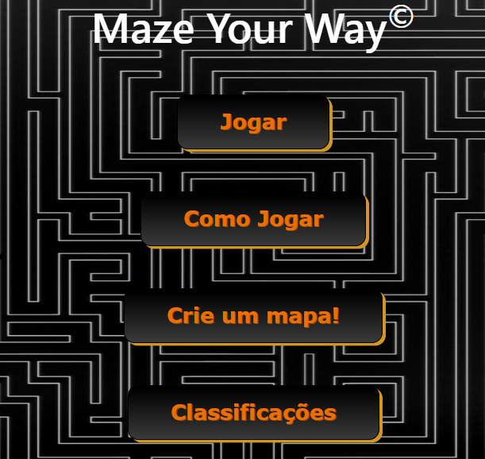
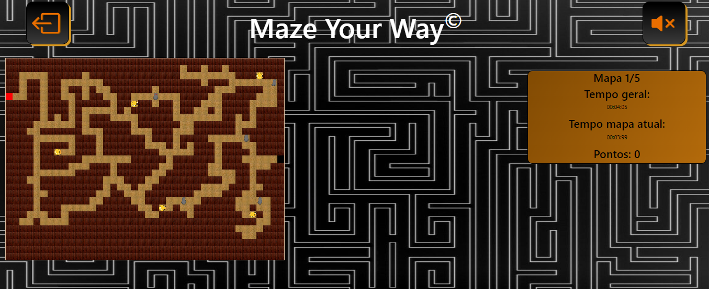

# Maze Your Way

A simple game developed in PHP. The game is easy to set up and run locally on your machine.

## Table of Contents

- [Getting Started](#getting-started)
- [Try the Game](#try-game)
- [Prerequisites](#prerequisites)
- [Installation](#installation)
- [Usage](#usage)
- [Contributing](#contributing)
- [Images](#images)
- [License](#license)
## Getting Started

Follow these instructions to get a copy of the game up and running on your local machine for development and testing purposes.

## Try the game
If you have any doubts about my game why don't you come and try it out:
- [Maze Game](http://mazegame.rf.gd/)

## Prerequisites

To run this game, you will need a local server environment that can run PHP. Here are a couple of recommended options:

- [XAMPP](https://www.apachefriends.org/index.html)
- [AMPPS](https://ampps.com/)
- Other way to or tool to runne PHP

## Installation

1. **Clone or download the repository:**

   ```bash
   git clone https://github.com/Mourinhom6/MazeGame.git

Or, download the ZIP file and extract it to your desired location.

2. **Place the files in your server's root directory:**

If you are using XAMPP, place the files in the **'htdocs'** folder. For AMPPS, use the **'www'** directory.

## Usage

1. Start your local server (XAMPP, AMPPS, etc.).

2. Open your browser and navigate to:

   ```bash
   http://localhost/index.php


3. To Use or see the Back Office open your browser and navigate to:

   ```bash
   http://localhost/backoffice.php

Ensure that your local server is running; otherwise, the PHP content will not load.

## Contributing
Contributions are welcome! Please fork the repository and create a pull request with your changes.

## Images

 


 

## License

[MIT](https://choosealicense.com/licenses/mit/)


